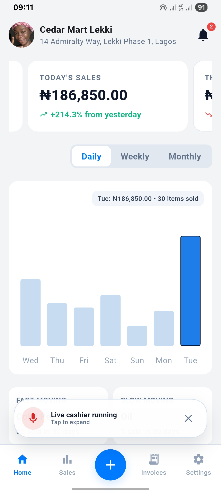
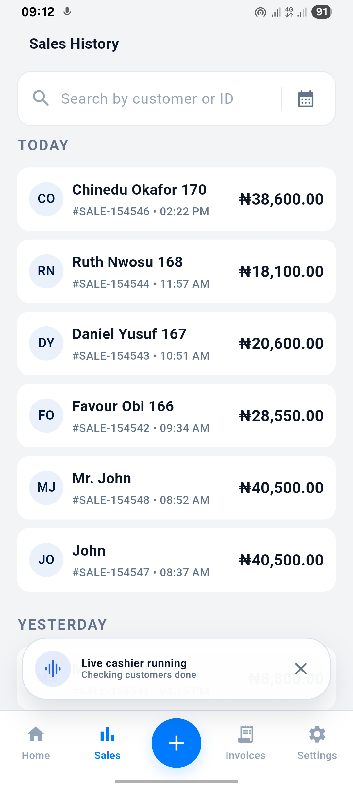
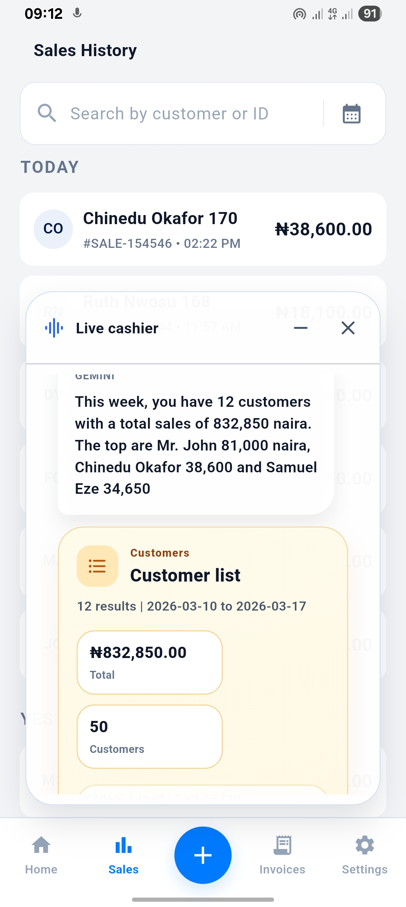

<!-- @format -->

# SalesNote Live Cashier

Voice-first AI cashier for small businesses that talks, listens, and handles receipts, invoices, and sales actions in real time.

## What It Is

SalesNote Live Cashier is a mobile sales assistant built for real small-business workflows.

Instead of forcing a seller to stop and fill forms while serving customers, SalesNote lets them speak naturally to a live AI cashier that can:

- respond with voice in real time
- be interrupted mid-sentence
- create receipts and invoices
- answer sales and analytics questions
- stay active while the user keeps navigating the app

This project was built for the **Gemini Live Agent Challenge** under the **Live Agents** category.

## Why We Built It

Most business apps are still built like paperwork.

That breaks down in the real world. A seller may need to:

- serve a customer
- confirm item details
- create a receipt
- check a sales summary
- move between screens quickly

Typing through a dense interface in that moment is slow and distracting.

SalesNote Live Cashier changes that interaction model from static UI to live collaboration.

## Core Capabilities

- realtime voice conversation with Gemini Live
- user interruption during agent speech
- persistent floating live cashier overlay
- draggable, non-blocking live assistant UI
- receipts and invoices created through live interaction
- grounded sales, item, customer, and analytics queries
- receipt and invoice preview, sharing, printing, and export flows
- reconnect handling for unstable networks
- device-side caching for startup assets and recent live cashier actions

## What Makes It Different

This is not a chatbot added on top of an app.

It is a live agent embedded into the workflow itself.

The live cashier can remain active while the user:

- navigates other screens
- opens previews
- checks sales data
- continues working in the app

That persistence makes it feel closer to a real cashier assistant than a normal turn-based assistant.

## Architecture


### Architecture Summary

1. The Flutter mobile app captures audio and manages the live cashier overlay.
2. The Rust backend authenticates the session and proxies websocket traffic.
3. Gemini Live handles realtime speech, transcription, interruption-aware responses, and tool calling.
4. Grounded business actions execute through SalesNote backend logic and data services.
5. PostgreSQL, Redis, Firebase, and Google Cloud support the full product workflow.

## Screenshots

<table>
  <tr>
    <td align="center">
      
    </td>
    <td align="center">
      
    </td>
    <td align="center">
      
    </td>
  </tr>
</table>

## Tech Stack

Dart, Rust, SQL, Bash, YAML, HTML/CSS, Flutter, Actix Web, WebSockets, Gemini Live API, Google Cloud, PostgreSQL, Redis, Hive, SharedPreferences, Flutter Secure Storage, Firebase Cloud Messaging, `record`, `flutter_sound`, `audio_session`, `printing`, GitHub Actions, Nginx, systemd, SSH, SCP.

## Repo Structure

```text
mobile/   Flutter mobile application
backend/  Rust API, worker, nginx/systemd scripts, migrations
.github/  CI/CD workflows for API, worker, website, Android, and iOS
```

## How the Live Cashier Works

1. The mobile app opens a websocket to the backend live agent route.
2. The backend authenticates the device and opens a second websocket to Gemini Live.
3. Mobile audio is streamed to Gemini through the backend proxy.
4. Gemini returns speech, transcripts, and tool calls.
5. The backend and mobile app ground those tool calls into real sales actions.
6. The user can keep using the app while the cashier remains active in a floating overlay.

## Why It Fits The Hackathon

SalesNote Live Cashier belongs in **Live Agents** because it is:

- voice-first
- realtime
- interruptible
- grounded in actual product actions
- persistent while the user continues using the app

It moves beyond simple text-in/text-out interaction and demonstrates a practical multimodal agent experience inside a real business product.

## Reproducibility / Spin-Up

### Backend

```bash
cd backend
cargo run --bin api
```

### Worker

```bash
cd backend
cargo run --bin worker
```

### Backend Environment

Create `backend/.env` and configure:

- PostgreSQL
- Redis
- JWT secret
- SMTP settings
- Firebase admin credentials
- Gemini API key

### Mobile

```bash
cd mobile
flutter pub get
flutter run
```

### Mobile Requirements

- Android or iOS device/emulator
- microphone permission
- network access to the backend

## Deployment

Deployment is automated with GitHub Actions and server-side scripts.

Relevant deployment files:

- [API deploy workflow](https://github.com/devfemibadmus/salesnote/blob/main/.github/workflows/api-deploy.yml)
- [Worker deploy workflow](https://github.com/devfemibadmus/salesnote/blob/main/.github/workflows/worker-deploy.yml)
- [Website deploy workflow](https://github.com/devfemibadmus/salesnote/blob/main/.github/workflows/website-deploy.yml)
- [Server automation script](https://github.com/devfemibadmus/salesnote/blob/main/backend/manage.sh)

These demonstrate:

- automated build
- artifact upload
- environment setup
- service restart
- nginx/systemd integration

## Google Cloud

The backend is deployed on Google Cloud infrastructure, and the project uses Gemini models plus Google Cloud-hosted backend services to satisfy the challenge requirement for Gemini + Google Cloud usage.
